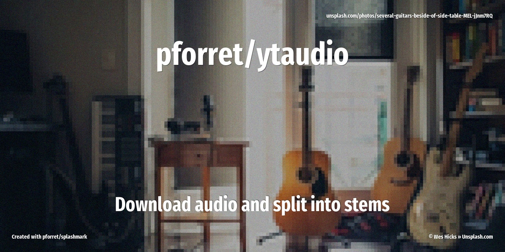

[](https://basher.gitparade.com/package/)

# pforret/ytaudio


ytaudio is a bash script for downloading audio from YouTube/SoundCloud and optionally splitting into stems using AI.
Built with the bashew framework, it's a command-line tool with multiple action modes.

## 🔥 Usage

```
Program : ytaudio  by peter@forret.com
Version : v1.2.0 (Dec 31 15:26:17 2023)
Purpose : Download audio (YouTube/Soundcloud/...) and split into stems
Usage   : ytaudio [-h] [-q] [-v] [-f] [-l <log_dir>] [-t <tmp_dir>] [-D <DOWNLOADER>] [-F <FORMAT>] [-O <OUT_DIR>] [-Q <QUALITY>] [-S <SPLITTER>] <action> <input?>
Flags, options and parameters:
    -h|--help        : [flag] show usage [default: off]
    -q|--quiet       : [flag] no output [default: off]
    -v|--verbose     : [flag] also show debug messages [default: off]
    -f|--force       : [flag] do not ask for confirmation (always yes) [default: off]
    -l|--log_dir <?> : [option] folder for log files   [default: log]
    -t|--tmp_dir <?> : [option] folder for temp files  [default: tmp]
    -D|--DOWNLOADER <?>: [option] download binary  [default: yt-dlp]
    -F|--FORMAT <?>  : [option] output audio format  [default: wav]
    -O|--OUT_DIR <?> : [option] output folder  [default: .]
    -Q|--QUALITY <?> : [option] audio quality  [default: 1]
    -S|--SPLITTER <?>: [option] stem splitting (full/voice)
    <action>         : [choice] action to perform  [options: get,loop,parallel,check,env,update]
    <input>          : [parameter] input URL (optional)
```

## ⚡️ Examples

```bash
# download 1 URL
% ytaudio get "https://www.youtube.com/watch?v=SFU1GeGFpzY"
./Tears For Fears - Everybody Wants To Rule The World.251s.mp3

# copy/paste URLs to download them one by one
% ytaudio loop
Copy/paste a URL and press <return> to start the download (one at a time)
https://www.youtube.com/watch?v=7dtpj8qa1hQ
./Funky Drummer (Bonus Beat Reprise).177s.mp3
https://www.youtube.com/watch?v=T1j1_aeK6WA
./Bernard 'Pretty' Purdie - The Legendary Purdie Shuffle.388s.mp3

✅  Program finished!

# copy/paste URls to start the download (in parallel)
% ytaudio parallel                                         
Copy/paste a URL and press <return> to start the download (in background)
https://www.youtube.com/watch?v=5J7IrPVLc4U                                    
https://www.youtube.com/watch?v=ghcsrblhn7A
./Steely Dan - Hey Nineteen - HQ Audio -- LYRICS.295s.mp3
./Steely Dan - Dirty Work.191s.mp3

✅  Program finished!
```

## 🚀 Installation

with [basher](https://github.com/basherpm/basher)

	$ basher install pforret/ytaudio

or with `git`

	$ git clone https://github.com/pforret/ytaudio.git
	$ cd ytaudio

This script needs the following programs on your system:

* file downloader [github.com/yt-dlp/yt-dlp](https://github.com/yt-dlp/yt-dlp)
* stem splitter [github.com/facebookresearch/demucs](https://github.com/facebookresearch/demucs)

```shell
python3 -m pip install -U yt-dlp
# or on macOS: 'brew install yt-dlp'

python3 -m pip install -U demucs
```

## 📝 Acknowledgements

* script created with [bashew](https://github.com/pforret/bashew)

&copy; 2022-2025 Peter Forret
